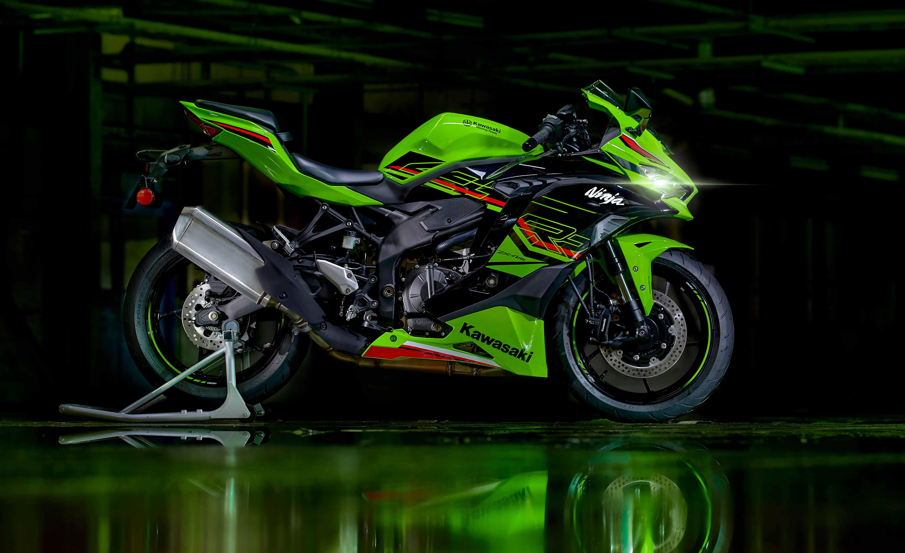
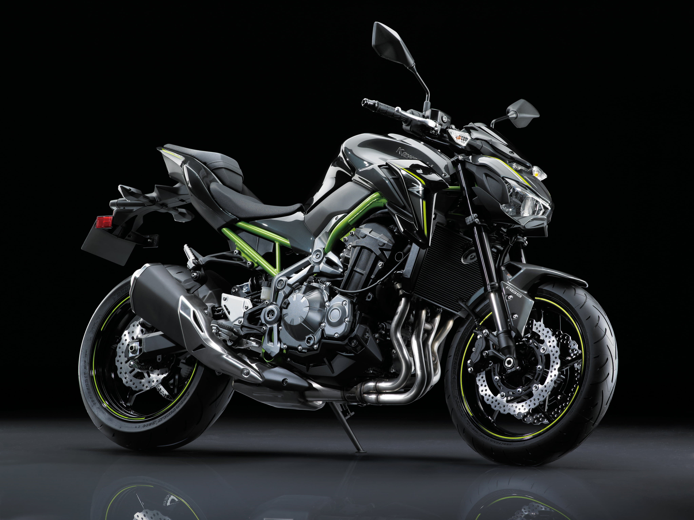
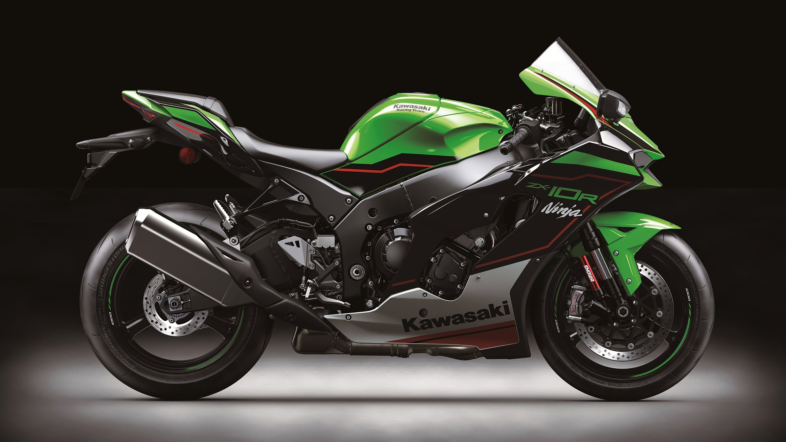
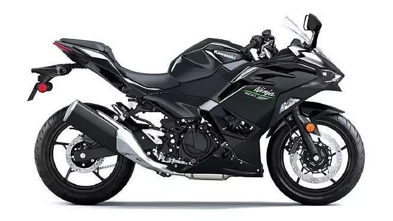
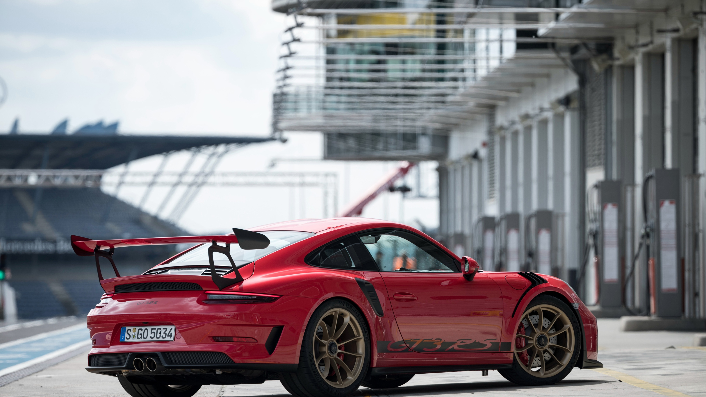
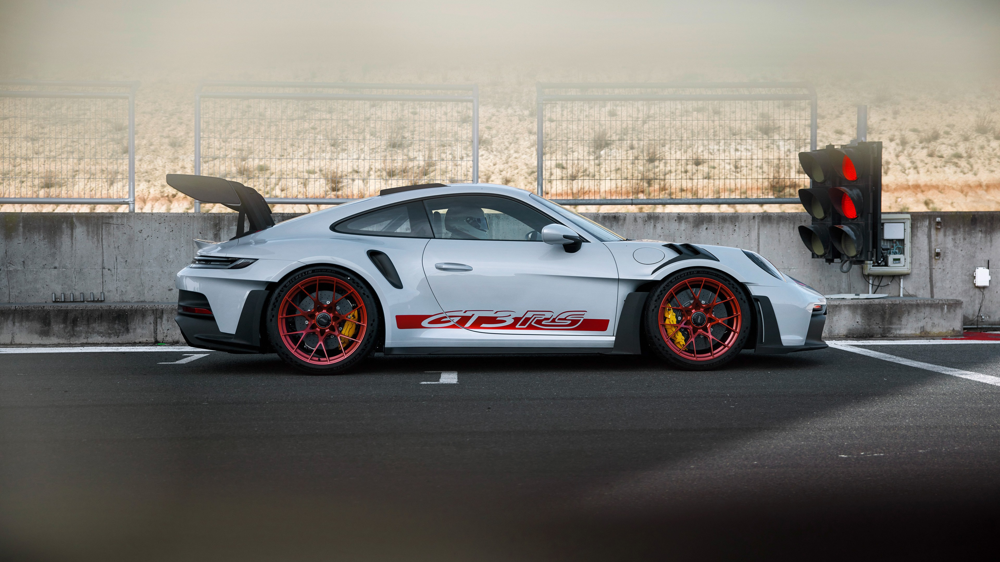

# EX01 Developing a Simple Webserver
## Date: 24/03/2024

## AIM:
To develop a simple webserver to serve html pages.

## DESIGN STEPS:
### Step 1: 
HTML content creation.

### Step 2:
Design of webserver workflow.

### Step 3:
Implementation using Python code.

### Step 4:
Serving the HTML pages.

### Step 5:
Testing the webserver.

## PROGRAM:
```
from http.server import HTTPServer, BaseHTTPRequestHandler
content = """
<!DOCTYPE html>
<html lang="en">

<head>
  <meta charset="UTF-8">
  <meta name="viewport" content="width=device-width, initial-scale=1.0">
  <title>WEB SERVER</title>
  <link href="https://cdn.jsdelivr.net/npm/bootstrap@5.3.3/dist/css/bootstrap.min.css" rel="stylesheet"
    integrity="sha384-QWTKZyjpPEjISv5WaRU9OFeRpok6YctnYmDr5pNlyT2bRjXh0JMhjY6hW+ALEwIH" crossorigin="anonymous">
    <link rel="stylesheet" href="https://cdn.jsdelivr.net/npm/bootstrap-icons@1.11.3/font/bootstrap-icons.min.css">
  <style>
    .cardsf {
      display: flex;
      flex-direction: row;
      justify-content: space-between;
    }
    h2{
        text-align: center;
    }
    

  </style>
</head>

<body>
  <nav class="navbar navbar-expand-lg bg-body-tertiary">
    <div class="container-fluid">
      <a class="navbar-brand" href="#"><i class="bi bi-house-fill"></i></a>
      <button class="navbar-toggler" type="button" data-bs-toggle="collapse" data-bs-target="#navbarSupportedContent"
        aria-controls="navbarSupportedContent" aria-expanded="false" aria-label="Toggle navigation">
        <span class="navbar-toggler-icon"></span>
      </button>
      <div class="collapse navbar-collapse" id="navbarSupportedContent">
        <ul class="navbar-nav me-auto mb-2 mb-lg-0">


          <li class="nav-item">
            <a class="nav-link active" aria-current="page" href="#bmw">BMW</a>
          </li>
          <li class="nav-item">
            <a class="nav-link active" aria-current="page" href="#kawasaki">Kawasaki</a>
          </li>
          <li class="nav-item">
            <a class="nav-link active" aria-current="page" href="#porsche">Porsche</a>
          </li>
          

        </ul>
        <div style="width: 20%; padding-top: 12px;" class="input-group mb-3">
          <input type="text" class="form-control" placeholder="SEARCH" aria-label="Recipient's username" aria-describedby="basic-addon2">
          <span class="input-group-text" id="basic-addon2"><i class="bi bi-search"></i></span>
        </div>
      </div>
    </div>
  </nav>


  <div style="display: flex;" class="carouself">
    <div style="width: 20%;"></div>
    <div style="width: 60%;" id="carouselExampleAutoplaying" class="carousel slide" data-bs-ride="carousel">
      <div class="carousel-inner">
        <div class="carousel-item active">
          
        </div>

        <div class="carousel-item">
          
        </div>
        <div class="carousel-item">
          
        </div>
      </div>
      <button class="carousel-control-prev" type="button" data-bs-target="#carouselExampleAutoplaying"
        data-bs-slide="prev">
        <span class="carousel-control-prev-icon" aria-hidden="true"></span>
        <span class="visually-hidden">Previous</span>
      </button>
      <button class="carousel-control-next" type="button" data-bs-target="#carouselExampleAutoplaying"
        data-bs-slide="next">
        <span class="carousel-control-next-icon" aria-hidden="true"></span>
        <span class="visually-hidden">Next</span>
      </button>
    </div>
    <div style="width: 20%;"></div>
  </div>


  <br><br>
  <div id="bmw">
    <h2 >BMW</h2>
    <div class="cardsf">
        <div class="card" style="width: 23rem;">
          
          <div class="card-body">
            <h5 class="card-title">BMW X1</h5>
            <p class="card-text">The BMW X Series comprises luxury SUVs known for their versatility, comfort, and dynamic performance. </p>
            <a href="#" class="btn btn-primary">Go somewhere</a>
          </div>
        </div>
    
        <div class="card" style="width: 23rem;">
          
          <div class="card-body">
            <h5 class="card-title">BMW M4</h5>
            <p class="card-text">The BMW X Series comprises luxury SUVs known for their versatility, comfort, and dynamic performance. </p>
            <a href="#" class="btn btn-primary">Go somewhere</a>
          </div>
        </div>
    
        <div class="card" style="width: 23rem;">
          
          <div class="card-body">
            <h5 class="card-title">BMW X1</h5>
            <p class="card-text">The BMW X Series comprises luxury SUVs known for their versatility, comfort, and dynamic performance. </p>
            <a href="#" class="btn btn-primary">Go somewhere</a>
          </div>
        </div>
    
        <div class="card" style="width: 23rem;">
          
          <div class="card-body">
            <h5 class="card-title">BMW XM</h5>
            <p class="card-text">The BMW X Series comprises luxury SUVs known for their versatility, comfort, and dynamic performance. </p>
            <a href="#" class="btn btn-primary">Go somewhere</a>
          </div>
        </div>
      </div>
    
  </div>

  <div id="kawasaki" style="margin-top: 5rem;">
    <h2 >Kawasaki</h2>
    <div class="cardsf">
        <div class="card" style="width: 23rem;">
          
          <div class="card-body">
            <h5 class="card-title">NINJA 400</h5>
            <p class="card-text">The Kawasaki Ninja, a series of sport motorcycles, is celebrated for its agility, speed, and cutting-edge technology, embodying adrenaline-fueled performance and iconic styling.


</p>
            <a href="#" class="btn btn-primary">Go somewhere</a>
          </div>
        </div>
    
        <div class="card" style="width: 23rem;">
          
          <div class="card-body">
            <h5 class="card-title">Z900</h5>
            <p class="card-text">The Kawasaki Ninja, a series of sport motorcycles, is celebrated for its agility, speed, and cutting-edge technology, embodying adrenaline-fueled performance and iconic styling.


</p>
            <a href="#" class="btn btn-primary">Go somewhere</a>
          </div>
        </div>
    
        <div class="card" style="width: 23rem;">
          
          <div class="card-body">
            <h5 class="card-title">ZX-10R</h5>
            <p class="card-text">The Kawasaki Ninja, a series of sport motorcycles, is celebrated for its agility, speed, and cutting-edge technology.


</p>
            <a href="#" class="btn btn-primary">Go somewhere</a>
          </div>
        </div>
    
        <div class="card" style="width: 23rem;">
          
          <div class="card-body">
            <h5 class="card-title">NINJA 500</h5>
            <p class="card-text">The Kawasaki Ninja, a series of sport motorcycles, is celebrated for its agility, speed, and cutting-edge technology, embodying adrenaline-fueled performance and iconic styling.


</p>
            <a href="#" class="btn btn-primary">Go somewhere</a>
          </div>
        </div>
      </div>
    
  </div>

  <div id="porsche" style="margin-top: 5rem;">
    <h2 >Porsche</h2>
    <div class="cardsf">
        <div class="card" style="width: 23rem;">
          
          <div class="card-body">
            <h5 class="card-title">PORSCHE GT3 RED</h5>
            <p class="card-text">The Porsche GT3 RS is a high-performance sports car, revered for its precision engineering, track-focused design, exhilarating driving experience, and iconic heritage in motorsport history.</p>
            <a href="#" class="btn btn-primary">Go somewhere</a>
          </div>
        </div>
    
        <div class="card" style="width: 23rem;">
          
          <div class="card-body">
            <h5 class="card-title">PORSCHE GT3 WHITE</h5>
            <p class="card-text">The Porsche GT3 RS is a high-performance sports car, revered for its precision engineering, track-focused design, exhilarating driving experience, and iconic heritage in motorsport history.</p>
            <a href="#" class="btn btn-primary">Go somewhere</a>
          </div>
        </div>
    
        <div class="card" style="width: 23rem;">
          
          <div class="card-body">
            <h5 class="card-title">PORSCHE GT3 SILVER</h5>
            <p class="card-text">The Porsche GT3 RS is a high-performance sports car, revered for its precision engineering, track-focused design.</p>
            <a href="#" class="btn btn-primary">Go somewhere</a>
          </div>
        </div>
    
        <div class="card" style="width: 23rem;">
          
          <div class="card-body">
            <h5 class="card-title">PORSCHE GT3 BLUE</h5>
            <p class="card-text">The Porsche GT3 RS is a high-performance sports car, revered for its precision engineering, track-focused design, exhilarating driving experience, and iconic heritage in motorsport history.</p>
            <a href="#" class="btn btn-primary">Go somewhere</a>
          </div>
        </div>
      </div>
    
  </div>


  <script src="https://cdn.jsdelivr.net/npm/bootstrap@5.3.3/dist/js/bootstrap.bundle.min.js"
    integrity="sha384-YvpcrYf0tY3lHB60NNkmXc5s9fDVZLESaAA55NDzOxhy9GkcIdslK1eN7N6jIeHz"
    crossorigin="anonymous"></script>
</body>

</html>
"""
class myhandler(BaseHTTPRequestHandler):
    def do_GET(self):
        print("request received")
        self.send_response(200)
        self.send_header('content-type', 'text/html; charset=utf-8')
        self.end_headers()
        self.wfile.write(content.encode())
server_address = ('',8000)
httpd = HTTPServer(server_address,myhandler)
print("my webserver is running at http://localhost:8000")
httpd.serve_forever()

```

## OUTPUT:
.png>)
.png>)
.png>)


## RESULT:
The program for implementing simple webserver is executed successfully.
